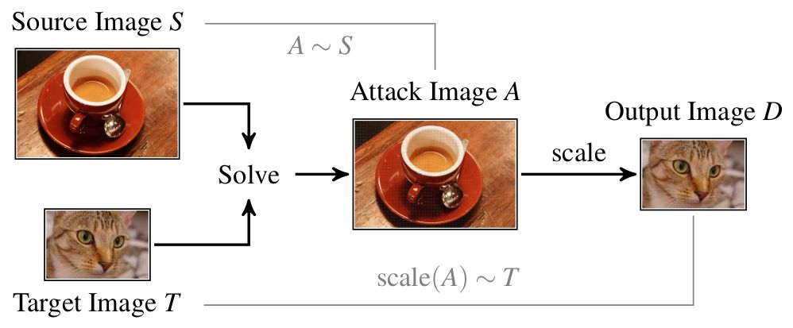

# A Comprehensive Analysis of Detection Methods for Image-Scaling Attacks

This repository belongs to the publication:

---

Erwin Quiring, Andreas Müller and Konrad Rieck.
On the Detection of Image-Scaling Attacks in Machine Learning.
*Proc. of Annual Computer Security Applications Conference (ACSAC)*, 2023.

---

The Bibtex key:
```
@inproceedings{QuiMueRie23,
        title={On the Detection of Image-Scaling Attacks in Machine Learning},
        author={Erwin Quiring and Andreas Müller and Konrad Rieck},
        year={2023},
        booktitle={Proc. of Annual Computer Security Applications Conference ({ACSAC})},
  }
```


## Background
<p align="center">

</p>

In short, image-scaling attacks enable an adversary to manipulate images, such
that they change their appearance/content after downscaling. In
particular, the attack generates an image A by slightly
perturbing the source image S, such that its scaled version D
matches a target image T. This process is illustrated in the figure above.

In this paper, we study different detection methods against image-scaling attacks.

For a root-cause understanding and prevention techniques, please look at [this paper from Quiring et al.](https://github.com/EQuiw/2019-scalingattack).

## Getting Started
First, make sure you have Python and [Anaconda](https://www.anaconda.com/download). 
In the following, we assume you are using Anaconda (any other system like virtualenv would also work). 

Next, get our repository (that builds up on [the repository from Quiring et al.](https://github.com/EQuiw/2019-scalingattack)):
```
git clone https://github.com/EQuiw/2023-detection-scalingattacks.git
cd 2023-detection-scalingattacks/scaleatt
``` 
Create a python environment:
```
conda create --name scaling-attack python=3.7
conda activate scaling-attack
```

Install python packages and compile cython extensions:
```
pip install -r requirements.txt
pip install -r requirements_jupyter.txt
python setup.py build_ext --inplace
```

Only in case of problems: check the [SETUP-README](./scaleatt/SETUP-README.md) in the scaleatt directory for a
detailed introduction how to set up the project.

## Tutorial
Now, in the scaleatt directory, just start Jupyter in the console.
```
jupyter notebook
```
1. You will be redirected to your web browser where you can run the notebooks.
2. Open Tutorial-Detection.ipynb
3. This file explains the attack, detection methods, and adaptive attacks step by step.


